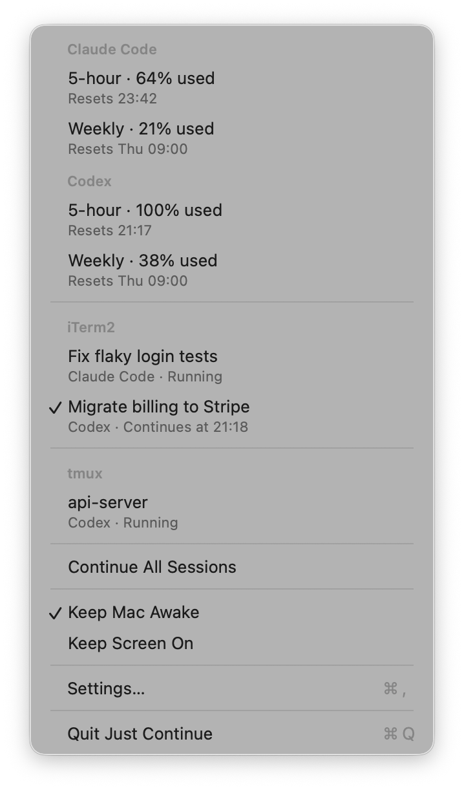
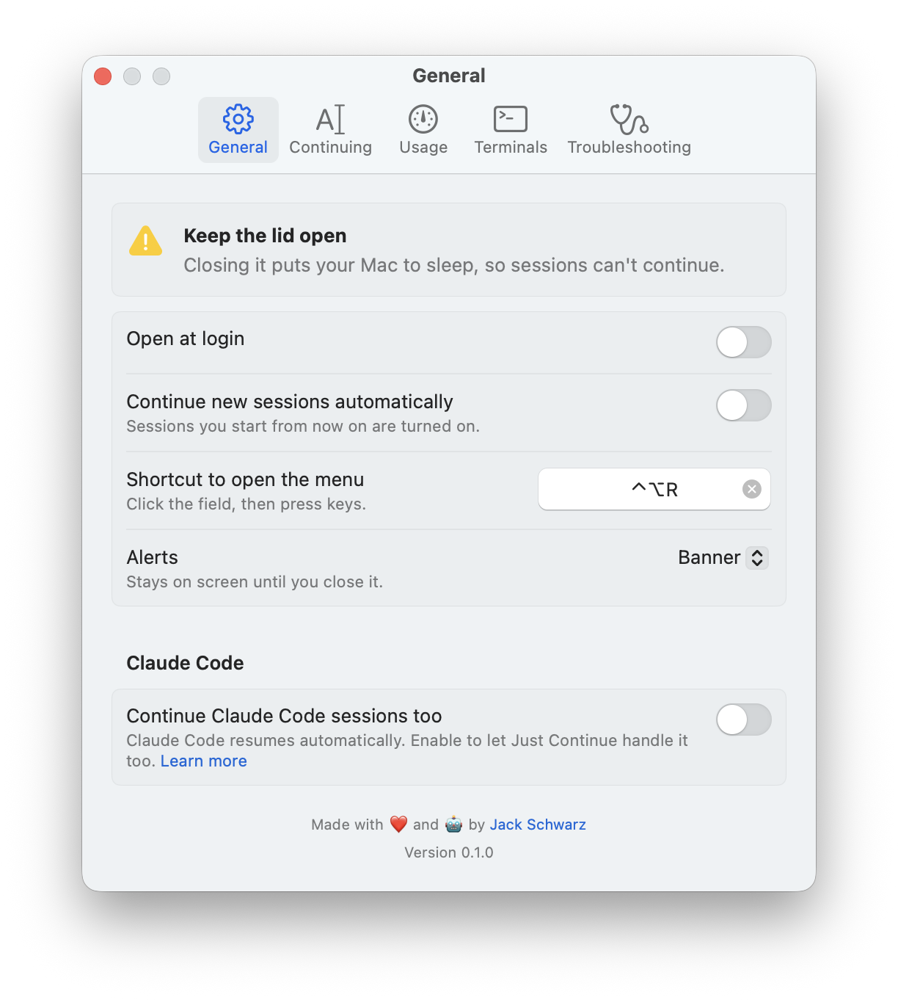
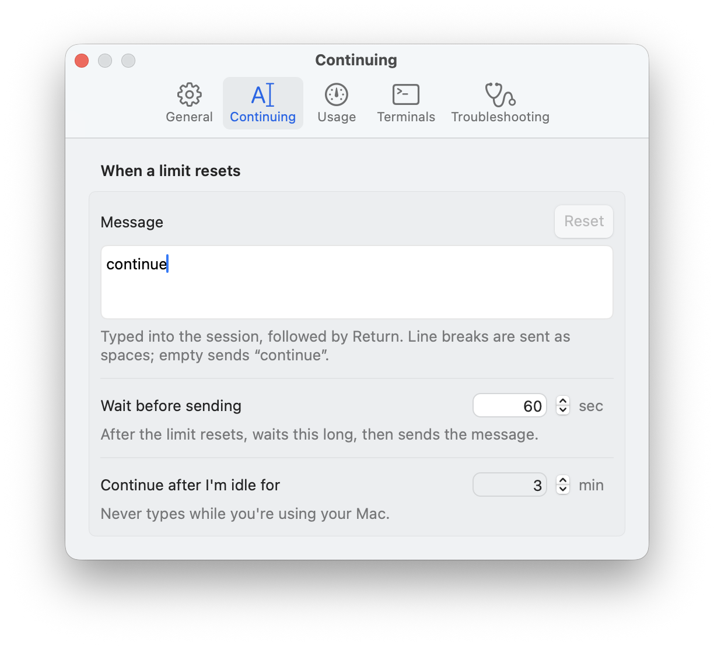
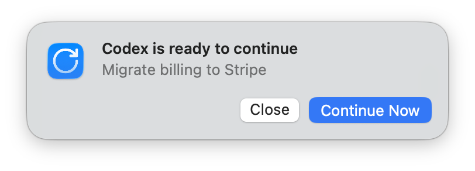
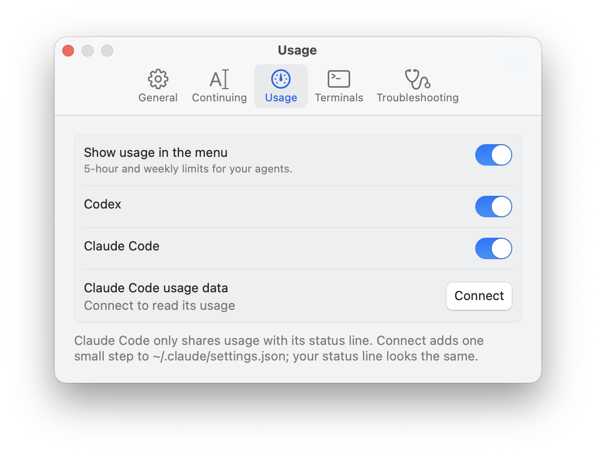

<p align="center">
  
</p>

<h1 align="center">Just Continue</h1>

Just Continue resumes **Codex CLI sessions after usage limits reset**. It runs in your macOS
menu bar and sends **`continue` followed by Return** to the terminal sessions you enable.

Keep those sessions open. The app reads their logs for the reset time, waits for the configured
delay, then sends the message when your Mac is idle or locked. If you're active, it shows a
notification instead. Before sending, it checks the session and terminal; afterward, it checks
for progress and retries if needed.

It also keeps your Mac awake while sessions are enabled and shows plan usage in the menu.
Everything runs locally. Claude Code is supported too, as described below.

<p align="center">
  
</p>

### Claude Code support

Claude Code already has [automatic continuation](https://code.claude.com/docs/en/interactive-mode#wait-for-a-usage-limit-to-reset)
for subscription sessions in v2.1.234+. Just Continue leaves eligible sessions to Claude by
default and keeps your Mac awake while it detects them waiting.

You can enable Claude sessions when built-in continuation is unavailable or turned off, or
when a reset is more than 24 hours away, such as some weekly limits. Plan usage is available
for both agents.

## Install

Requires **macOS 14+** and **Xcode 26+** to build. From the repository folder:

```sh
scripts/build-app.sh
mv "build/Just Continue.app" /Applications/
open "/Applications/Just Continue.app"
```

Supports **Codex CLI** and **Claude Code CLI** in Terminal.app, iTerm2, Ghostty 1.3+, or tmux.
Other terminals work through tmux. Agent desktop apps aren't supported.

Open **Settings › Terminals** and allow terminal access before leaving your Mac.
Keep a laptop's lid open unless it's set up to stay awake with an external display.

## Use

Click a session in the menu to enable or disable automatic continuation. Hold **⌥** for
**Continue Now**, **Show in Terminal**, and **Reveal in Finder**. **⌃⌥R** opens the menu;
a dot on the menu-bar icon means at least one session is enabled.

Settings let you change the message, delay after reset, idle threshold, shortcut, and alerts,
or enable new sessions automatically.

<p align="center">
  
</p>

<details>
<summary>Continuing settings and notification</summary>
<p align="center">
  
</p>
<p align="center">
  
</p>
</details>

### Plan usage

Turn on **Show usage in the menu** in **Settings › Usage**. Codex usage is read automatically.
For Claude Code, click **Connect** to copy usage data from its status line. This backs up and
updates `~/.claude/settings.json`, preserving your existing status-line command.
**Disconnect** removes the added step.

<p align="center">
  
</p>

## Privacy and troubleshooting

The app reads local process information, agent session logs in `~/.claude` and `~/.codex`,
and idle status—not your keystrokes. It sends no telemetry. Terminal input uses AppleScript
or `tmux send-keys`.

If a session can't be enabled, hold **⌥** and choose **How to Enable…**. For other problems,
turn on **Settings › Troubleshooting › Detailed logging**, reproduce the issue, and use
**Create Report…**. Review the report before sharing it.

Rebuilding can reset macOS Automation permissions. To use a stable signing identity:

```sh
SIGN_IDENTITY="Developer ID Application: …" scripts/build-app.sh
```

## Development

```sh
swift build
swift test
scripts/build-app.sh                       # build/Just Continue.app
```

`Sources/JustContinueCore` contains discovery, log parsing, terminal adapters, and the resume
engine. `Sources/JustContinue` contains the app and UI. Tests use synthetic logs and fakes.

Debug tools:

```sh
.build/debug/JustContinue --scenario-test
.build/debug/JustContinue --ui-test
.build/debug/JustContinue --render /tmp/ui --demo
.build/debug/JustContinue --list-sessions
```

## License

[MIT](LICENSE). The Lucide `rotate-cw` icon uses the ISC license; see
[third-party notices](THIRD_PARTY_NOTICES.md).
