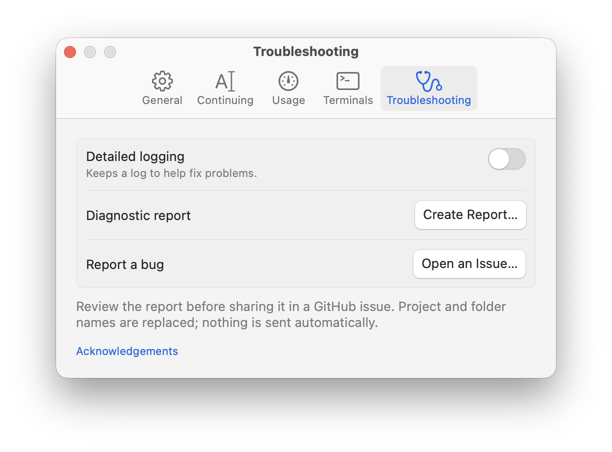

<p align="center">
  
</p>

<h1 align="center">Just Continue</h1>

When a **Codex CLI session hits its usage limit**, Just Continue waits for the limit to reset,
then **types `continue` and presses Return in that session** so Codex can carry on.

The app runs in your macOS menu bar. Enable the sessions you want it to continue and leave
their terminals open. After the reset and your configured delay, it sends the message when
your Mac is idle or locked. If you're active, it shows a notification with **Continue Now** instead.

Supports **Terminal.app, iTerm2, Ghostty 1.3+, and tmux**. Other terminals work through tmux.
It also keeps your Mac awake and shows plan usage. Claude Code support is described below.

[GitHub](https://github.com/jackschwarz2017/just-continue) ·
[Report an issue](https://github.com/jackschwarz2017/just-continue/issues) ·
[Sponsor](https://github.com/sponsors/jackschwarz2017)

<p align="center">
  
</p>

### Claude Code support

Claude Code already has [automatic continuation](https://code.claude.com/docs/en/interactive-mode#wait-for-a-usage-limit-to-reset)
for subscription sessions in v2.1.234+. Just Continue leaves eligible sessions to Claude by
default and keeps your Mac awake while it detects them waiting.

You can enable Claude sessions when built-in continuation is unavailable or turned off, or
when a reset is more than 24 hours away, such as some weekly limits. Plan usage is available
for both agents.

## Install

Requires **macOS 14+**. The signed and notarized app supports **Apple Silicon and Intel**.

[Download the DMG from GitHub Releases](https://github.com/jackschwarz2017/just-continue/releases).
Open it, drag **Just Continue** into **Applications**, and launch the app.

To build from source, see [Development](#development).

Works with **Codex CLI** and **Claude Code CLI**. Agent desktop apps aren't supported.

Open **Settings › Terminals** and allow terminal access before leaving your Mac. If access is
missing, the menu shows **Allow terminal access to continue**. Click it to finish setup; if you
previously denied access, Settings links to macOS Privacy & Security › Automation.
Keep a laptop's lid open unless it's set up to stay awake with an external display.

## Use

Click a session in the menu to enable or disable automatic continuation. Hold **⌥** for
**Continue Now**, **Show in Terminal**, and **Reveal in Finder**. **⌃⌥R** opens the menu;
a dot on the menu-bar icon means at least one session is enabled.

Settings let you change the message, delay after reset, idle threshold, shortcut, and alerts,
or enable new sessions automatically.

<p align="center">
  
</p>

<details>
<summary>Continuing settings and notification</summary>
<p align="center">
  
</p>
<p align="center">
  
</p>
</details>

### Plan usage

Turn on **Show usage in the menu** in **Settings › Usage**. Codex usage is fetched from your
account every minute through the installed Codex CLI, including usage on your other Macs.
Sign in to Codex with ChatGPT first. If the request fails, the app shows usage as unavailable.
If a reset card restores quota early, fresh readings showing both limits below 100% let enabled
Codex sessions continue after your configured delay. These checks also run while enabled Codex
sessions are waiting with the usage display hidden; idle and terminal checks still apply.

For Claude Code, click **Connect** to copy usage data from its status line. This is a local
snapshot, not a live account query: old readings are labelled “Last seen”, and expired windows
show usage as unavailable. Connecting backs up and updates `~/.claude/settings.json`,
preserving your existing status-line command.
**Disconnect** removes the added step. For sessions handled by Just Continue, a newer snapshot
showing usage drop from exhausted to available can also shorten the wait. A Claude reset card
cannot be detected until Claude supplies updated usage data.

<p align="center">
  
</p>

## Privacy and troubleshooting

The app reads local process information, agent session logs in `~/.claude` and `~/.codex`,
and idle status—not your keystrokes. For live usage, it asks the Codex CLI to contact OpenAI
using your existing sign-in; Just Continue never reads or stores your account tokens. It sends
no app telemetry. Terminal input uses AppleScript or `tmux send-keys`.

If a session can't be enabled, hold **⌥** and choose **How to Enable…**. For other problems,
turn on **Settings › Troubleshooting › Detailed logging**, reproduce the issue, and use
**Create Report…**. Review the report, then choose **Open an Issue…** to report the bug on GitHub.

<details>
<summary>Troubleshooting settings</summary>
<p align="center">
  
</p>
</details>

Rebuilding can reset macOS Automation permissions. To use a stable signing identity:

```sh
SIGN_IDENTITY="Developer ID Application: …" scripts/build-app.sh
```

## Development

Building from source requires **Xcode 26+**. From the repository folder:

```sh
swift build
swift test
scripts/build-app.sh                       # universal app in build/
```

`Sources/JustContinueCore` contains discovery, log parsing, terminal adapters, and the resume
engine. `Sources/JustContinue` contains the app and UI. Tests use synthetic logs and fakes.

Debug tools:

```sh
.build/debug/JustContinue --scenario-test
.build/debug/JustContinue --ui-test
.build/debug/JustContinue --render /tmp/ui --demo
.build/debug/JustContinue --list-sessions
```

## License

[MIT](LICENSE). The Lucide `rotate-cw` icon uses the ISC license; see
[third-party notices](THIRD_PARTY_NOTICES.md).
